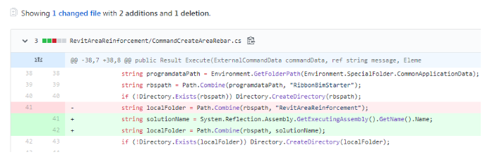
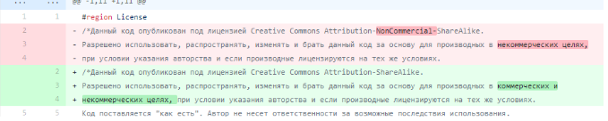
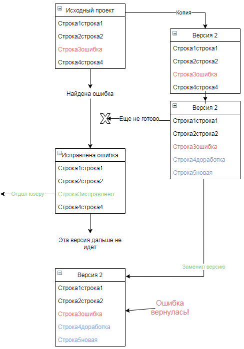
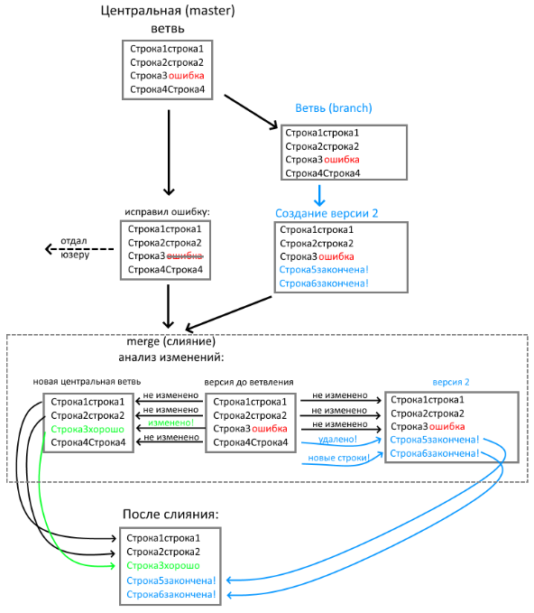
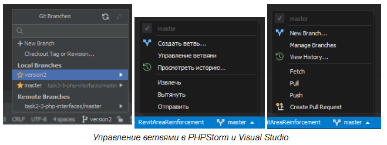

# Почему без системы контроля версий не обойтись?

Распространено мнение, что системы контроля версий нужны только тогда, когда над одним проектом работают несколько программистов. И правда, если работаешь один то ведь: поработал-сохранился-поработал-программа готова? У меня самого долгое время проекты просто лежали на Яндекс-диске: с ним и файлы не потеряются если с компом что-то случится, и работать из разных мест можно, и даже предыдущие версии файлов сохраняются. Почему же системы контроля версий всё-таки необходимы?

## VCS показывает, что именно изменилось в документе

Представим ситуацию: делаю я проект, сделал работающую первую версию. Потом решил добавлять новый функционал. И вдруг замечаю, что программа стала падать со странной ошибкой. Очевидно, что при каком-то изменении что-то испортил в коде. Было бы полезно поднять предыдущие версии и посмотреть, в какой всё работало нормально. Но даже если с возьму бэкапы с Яндекс-диска, я получу просто много копий файлов, надо будет вручную искать, что именно в них изменилось.

Системы контроля версий не просто хранят предыдущие версии, но и показывают, **что именно изменилось**. Например, показываются удаленные и новые строки в коде:

В случае, если что-то изменилось в самой строке, то красным цветом показывается её предыдущее состояние, зеленым - новое, и внутри строки выделено, что именно в ней изменилось:

Супер-тема даже когда один работаешь, яндекс-диски и рядом не валялись, что уж говорить когда работают несколько людей и надо контролировать кто чего меняет. И этот анализ изменений важен не только для того, чтобы самому их просматривать, но и в других функциях, например при слиянии и анализе конфликтов (см. далее).

## VCS позволяет вести несколько версий одновременно

Работаю дальше над своим проектом, вношу улучшения, а первую версию уже юзерам отдал, чтобы работали. И тут вот мне говорят, что в программе мелкая ошибка - опечатка, из-за которой не сохраняются файлы. Всего лишь дописать бы одну букву и пересобрать проект, и всё заработает; но блин, я же тут переделываю, всё разломанное-неработающее! Заставлять юзера ждать новую версию всего-лишь из-за этой опечатки - как-то обидно. 

Наверное, лучше было бы перед этим внесением большого изменения сделать копию всего проекта и ковырять уже отдельно, а когда закончу “версию 2” - заменить “центральную” версию на измененную. В этом случае и “центральную версию” не испорчу, и в случае чего смогу подправить мелкие ошибки и быстро выдать исправление.

Но надо помнить, что любое копирование - признак "[дурно пахнущего кода](https://ru.wikipedia.org/wiki/Дублирование_кода)"!

Когда я сделал копию - я скопировал и ту опечатку, значит, надо не забыть исправить её и в в master-версии, и в копии. (а я обязательно забуду).

Отсюда возникает следующая задача - ветви (**branch**). Это похоже на "копирование", но Git умеет “интегрировать” (**merge**) изменения из “копии” в центральную версию. Это работает потому, что как мы уже видели раньше, Git видит, *что именно* изменилось в коде - эти изменения он и внедряет в центральный файл.

Таким образом, если я сделаю “ответвление” и буду вносить корректировки, и одновременно с этим  обнаружу опечатку в центральной версии и там тоже что-то изменю - то ни то, ни другое не потеряется:

## И умеет много чего еще

Например, что произойдет, если одну и ту же строку изменить и в основной ветке, и в параллельной? Вопрос интересный! При этом при попытке merge произойдет конфликт, и нужно будет вручную выбрать, какую версию считать окончательной. Если использовать *IDE* (среду разработки), то там будет есть специальный режим, где можно выбрать, какие части кода из какой ветки нужно взять.

Столько полезного - и это ещё даже речь не зашла о работе нескольких человек над одним проектом! VCS дают еще больше возможностей:
- показывают, кто и когда изменил определенный фрагмент кода;
- контролируют права на доступ, например, можно дать доступ к определенным файлам только на чтение (хотя в Git такого функционала, к сожалению, нет);
- можно не менять центральную ветку напрямую (рискованное дело всё-таки), а делать запрос на добавление (*request*), а другой сотрудник может проверить код и либо одобрить его, - либо отменить; 
- можно зафиксировать определенное состояние (версию) проекта при помощи тэгов (*tag*) и получить его в любой момент даже после того, были внесены изменения (это работает потому, что сохраняются все версии файлов за всё время проекта).

---
[< К содержанию](./readme.md) | [Далее >](./03_workflow.md) 