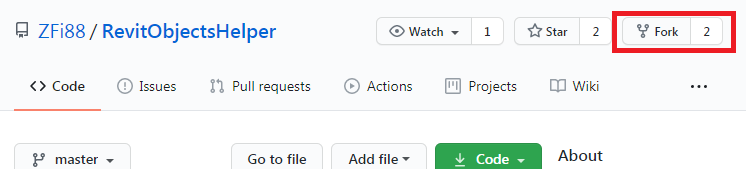

# Ветви и модели ветвления в Git

В только что созданном проекте уже есть одна ветвь - главная, она же *master*. В принципе, если наш проект небольшой, то можно вносить все изменения сразу в master-ветвь.


Но, как я уже говорил ранее, если нужно внести большое изменение, то лучше вынести его в отдельную ветвь, протестировать и уже после этого вливать в "основную" ветку, иначе слишком велик риск всё испортить. Это ещё более важно, когда над проектом работают несколько человек.


Благодаря такому подходу можно исправлять мелкие ошибки (желтая ветка), не дожидаясь, пока будет завершено крупное обновление (синяя ветка), а основная ветвь (зеленая) всегда работоспособна.

В реальных больших проектах можно применить разные способы организации работы.

Например, для небольшого проекта с несколькими участниками можно просто выделить ветку для каждого разработчика:


Или, например, такой подход: вводится второстепенная ветка, с от которой начинаются и с которой сливаются все нововведения, и затем уже от этой ветки периодически сливаются изменения в master-ветвь:


*Images by [skillfactory.ru](skillfactory.ru)*

Есть и еще более "продвинутые" способы организации, например Gitflow. Конкретный метод зависит от масштаба проекта, а в реальной практике будет выбран руководителем проекта, вам только потребуется соблюдать требования.

Новая ветка создается командной git checkout, а "переключаться" между ветками можно через [git switch](./command_switch.md).

### Форк - "развилка" проекта

Также следует упомянуть *форк* - "развилку" проекта (от англ. fork - вилка). Это пригодится, когда есть чей-то чужой проект, который вас почти устраивает, но нужно внести какие-то изменения. Полностью скопировать проект и неэтично, и еще и потеряем улучшения, которые автор ещё будет вносить. Или бывает так, что *[пушить](./command_push.md)* в чужой проект вам вообще нельзя, а доработать надо.

Вместо копирования я создам *форк* с чужого проекта. В Github для этого есть кнопка:



После этого проект появится уже в списке наших репозиториев, и я могу стянуть его к себе обычной командой [git clone](./command_clone.md).
Теперь я смогу внести изменения, какие мне хочется, но при этом и сохранится связь с исходным проектом и я смогу загружать из него какие-то улучшения.
Ссылка origin будет указывать на наш скопированный проект, а не на исходный. Но можно добавить привязку ещё и на исходный проект, чтобы вытягивать из него обновления. Его принято называть upstream:
```
git remote add upstream git://github.com/octocat/Spoon-Knife.git
git fetch upstream
```

Кроме того, можно и наоборот, передать изменения в "родительский" проект. Например, это используется в методике ветвления Fork Workflow.


[< К содержанию](./readme.md) | [Далее >](./07_request.md) 
