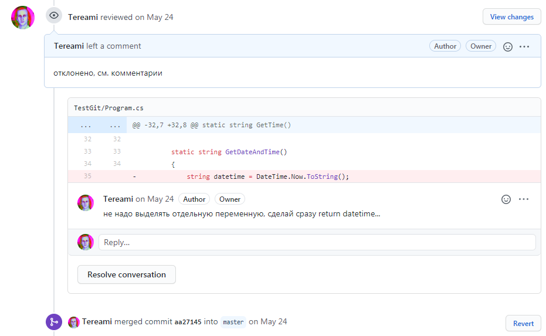

# Запросы

Конечно, разрешать неопытному разработчику (то есть мне) брать и вносить изменения в большой серьезный проект - плохая идея. Лучше, чтобы кто-то более опытный посмотрел мой код и уже затем передал его в основной репозиторий. Или, наоборот, отклонил и оставил комментарии, что надо переделать.

Для этого в Git предусмотрен функционал *pull request* - "запрос на добавление".
Выглядит это примерно так:



Pull request особенно полезны, когда работа ведется в [форке](./06_branches.md), и надо уведомить, что мы хотим что-то передать в главный проект. Но запросы можно делать и при работе с одним общим репозиторием.

Создавать pull-request можно либо в интерфейсе Github, либо через командную строку:
```
git request-pull yourCommitName https://repositorypath branchName
```

Написал и сам ничего не понял... Ладно, всё равно это никто не прочитает


[< К содержанию](./readme.md) | [Далее >](./08_gitignore.md) 