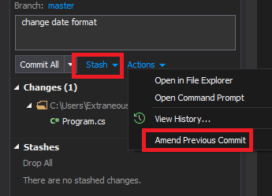

# Другие возможности Git

Здесь перечислю понятия git, которые мне встречались, но пока не понял, что они делают. Может быть, кто-то поможет и допишет!

* amend
* stash / unstash
* rebase
* fork

[< К содержанию](./readme.md) | [Далее >](./10_end.md) 